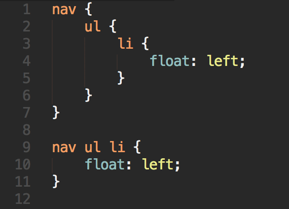
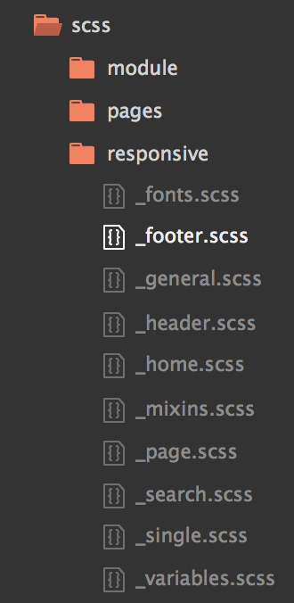
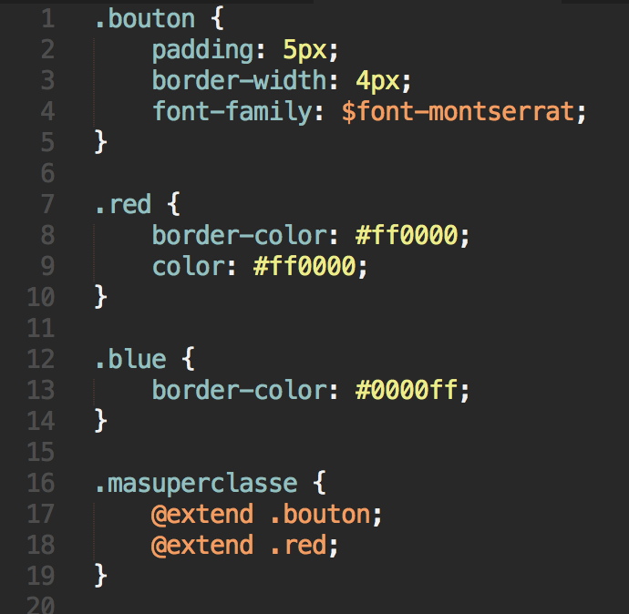
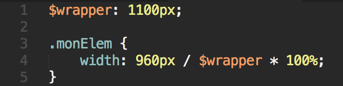
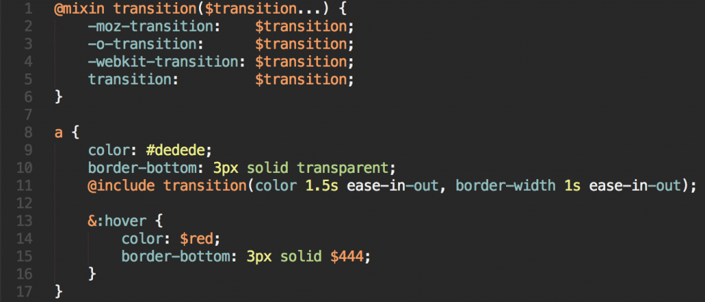

<h1>TUTO SUR SASS</h1>
  

SASS est une évolution du CSS. Le CSS d’aujourd’hui possède des limites, c’est la raison pour laquelle des gens ont construit ce que l’on appelle des pré-processeurs du langage CSS.   
Pour faire simple, ce sont des extensions du langage CSS.   
Comme si on venait y greffer tout un set de fonctions supplémentaires, user made.   
Pour le coup, SASS est développé sur le langage Ruby.   
Un pré-processeur signifie également qu’il y a un processus de compilation, entre le code d’entrée (donc le SASS), et le code de sortie, qui ici sera du CSS.   
En fait, tu écris tout ton code bourré de fonctions en plus, et le compilateur de SASS s’occupe tout seul de traduire tout ça en CSS tout à fait normal, pour que tu puisses l’utiliser n’importe où après.   
  
<b>sass –watch scss:css</b> : permet de surveiller les changements faient sur le fichier scss afin qu’il le compile automatiquement en css.  
  
<u>L’emploi de variables</u> : <b>$variable: valeur;</b>  

Le <u><b>nesting</b></u> : c’est un système qui permet d’appliquer le principe d’héritage au css.  
  
<u>Exemple :</u>  
  

<u>Les feuilles de style partiales :</u>   
  
  
<u>L’extension de classes :</u>   
  

<u>Les opérateurs :</u>   
   
  
<u>Les mixins :</u>  

